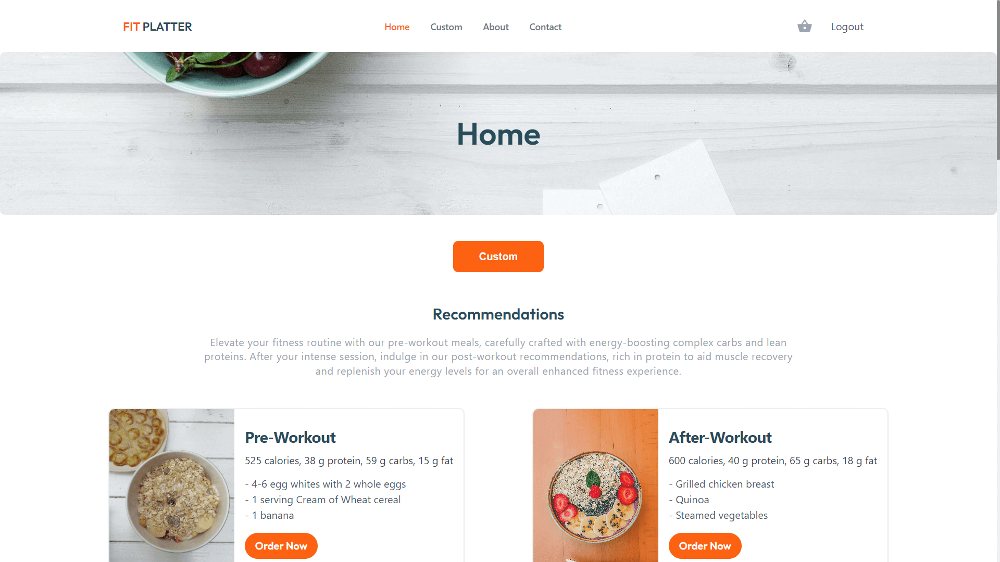

# Fit Platter App

Fit Platter is a dynamic web application created using React and Vite, designed to provide personalized sports-centric meal recommendations. Leverage the power of modern frontend technologies to enhance your fitness journey with customized nutrition.

<center>
    
</center>

## Installation Guide

### Prerequisites

Node.js: Ensure Node.js is installed on your machine. You can download it [here](https://nodejs.org/).

### Clone the Repository

#### run frontend
```bash
    git clone https://github.com/themeddev/FIT-PLATTER.git
    cd FIT-PLATTER/frontend

```

### Install Dependencies

```bash
    npm install

```

### Run the App

```bash
    npm run dev

```

This will start the development server, and you can access the app at http://localhost:3000.

### Build for Production

To build the app for production, use the following command:

```bash
    npm run build

```

#### run backend
```bash
    cd FIT-PLATTER/backend

```

### Install Dependencies

```bash
    npm install
    composer install
    php artisan db:migrate
    php artisan db:seed

```

### Run server

```bash
    php artisan serve

```

This will start the development server, and you can access the app at http://localhost:5173.

### Build for Production

To build the app for production, use the following command:

```bash
    npm run build

```

This will generate optimized production-ready assets in the dist directory.

### App Structure