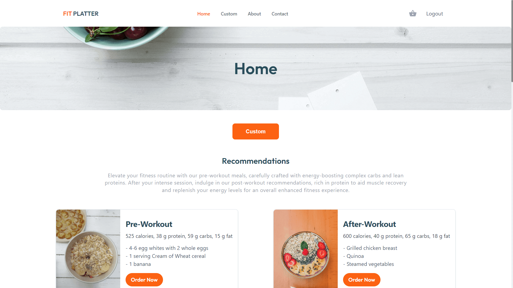

# Fit Platter App

Fit Platter is a dynamic web application created using React and Vite, designed to provide personalized sports-centric meal recommendations. Leverage the power of modern frontend technologies to enhance your fitness journey with customized nutrition.

<center>
    
</center>

## Installation Guide

### Prerequisites

Node.js: Ensure Node.js is installed on your machine. You can download it [here](https://nodejs.org/).

### Clone the Repository

```bash
    git clone https://github.com/themeddev/FE-FIT-PLATTER.git
    cd FE-FIT-PLATTER

```

### Install Dependencies

```bash
    npm install

```

### Run the App

```bash
    npm run dev

```

This will start the development server, and you can access the app at http://localhost:3000.

### Build for Production

To build the app for production, use the following command:

```bash
    npm run build

```

This will generate optimized production-ready assets in the dist directory.

### App Structure

`src/components`: Contains React components used throughout the app.
`src/pages`: Houses individual pages and their components.
`src/utils`: Includes utility functions and helper modules.
`TailwindCss`: Holds global styles and styling variables.
Feel free to explore and customize the app based on your needs. If you encounter any issues or have suggestions, please open an issue or submit a pull request. Happy coding!
